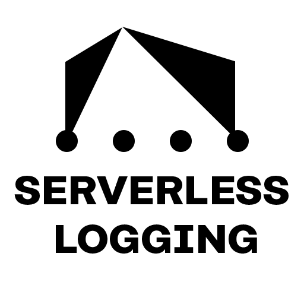
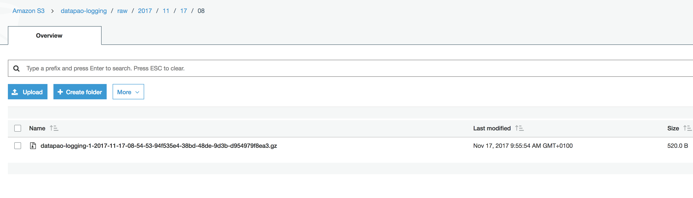
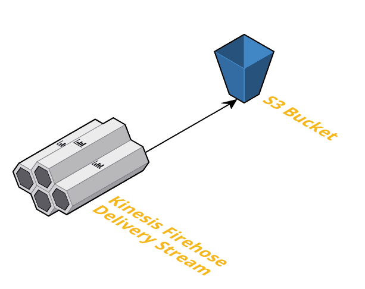

# AWS Structured Serverless logging
Cheap structured serverless logging system that scales automatically.

## Create AWS infrastructure
The following script will ask for the required input and then proceeds to create the necessary resources.
```
python3 bootstrap.py
```


## Send test log messages
To send 3000 log message to the log sytem use the `test.py`.
```
python3 test.py <stream-name> 3000
```


The test messages  will be delivered to S3, buffered and compressed.


## Architecture
The architecture is quite simple.


1. The provided logger logs messages into the Kinesis Firehose delivery stream
2. The stream buffers and compresses the log messages and delivers it to S3
3. You can query the log messages with EMR (Spark, MR, etc..), Athena

## Logger
We provide an out-of-the-box logger with `logger.py`.
Import the Logger class and use it to log structured messages.
```python
# Initiate the logger with the stream/logging name
logger = KinesisLogger("datapao-logging-3")

# Simple message log
logger.info({ "message": "Failed to run batch job" })

# Batch log messages
logger.log_batch([
    { "level": "INFO", "message": "Failed to run batch job" },
    { "level": "DEBUG", "origin": "testing", "sensor": "temp-0002xb" }
])
```
The logger automatically adds an ISO8601 UTC timestamp to every message. It also offers convenient logging functions that adds a `Level` attribute.

## TODO
The development tasks are tracked in [Projects](https://github.com/datapao/serverless-logging/projects/1)

## Contribution
Feel free to send any feedback, PR or unneccesary GIFs.

---

Created with :heart: at <a href="http://datapao.com"></a>

